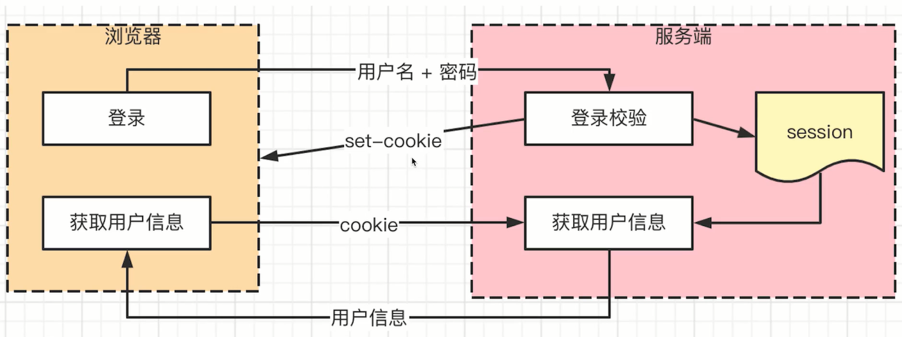

## Cookie
+ http 是无状态的，需要通过cookie识别用户身份
+ 服务段可以向客户端设置cookie， set-cookie， cookie 有大小限制，4KB
+ 默认有跨域限制：默认不可以跨域共享，某些情况可以设置共享。默认不可以传递
    - （某些情况）主域名一致，设置cookie为主域名实现跨域共享 domain=.baidu.com
    - 主域名完全不同，则cookie无法共享
    - 传递：前后端设置通过设置 withCredentials 设置前后端跨域传递cookie
+ 现代浏览器会禁止网页引入的第三方JS设置cookie
    - 目的是为了打击第三方广告，保护用户隐私
    - 新增属性 SameSite： Strict\Lax\None。严格、松散、不禁用。（SameSite）([cookie-samesite](https://www.ruanyifeng.com/blog/2019/09/cookie-samesite.html))
+ 登录验证时，只有cookie没有session，登录时不完善的
    - cookie 用于登录验证，保存sessionId（用户登录标识）
    - session 保存在服务段，储存用户详细信息，和 cookie信息(sessionId)一一对应
    - cookie + session 是创建的登录验证方案

PS：跨域：协议，域名，端口，需要完全一致，否则就是跨域。

## token

|                                           cookie                                            |                                                 token                                                 |
| ------------------------------------------------------------------------------------------- | ----------------------------------------------------------------------------------------------------- |
| HTTP标准                                                                                     | 无标准，民间自发行为，自定义传递                                                                         |
| 浏览器API，网络通信会自动携带cookie                                                            | 需要自己存储，传递                                                                                     |
| 有跨域限制                                                                                   | 没有跨域限制                                                                                           |
| 请求头 cookie                                                                                | 习惯保存为Authorization                                                                                |
| 配合session使用，cookie保存在客户端，只保存用户ID（sessionId），配合保存在服务端的session完成鉴权 | 一般通过JWT（JSON Web Token）生成，包含用户的全部信息，通过接口返回，没有大小限制，用户登录信息保存在浏览器端 |

### JWT（JSON Web Token）

三部分

## Session 和 token

### Session

 #### Session 优点

+ 原理简单，易于学习理解
+ 用户信息存储在服务端，可以快速封禁某个用户（秒级封禁）。

  #### Session 缺点
 
+ 占用服务端内存，硬件成本高
+ 多进程，多服务器是，不好同步---需要使用第三方缓存，如redis
    - session保存在内存中，内存相互隔离，多进程之间的内存是隔离的，session需要在进程中同步，或者存在第三方
+ 默认有跨域限制

 ### JWT
 
 #### JWT 优点

+ 不占用服务端内存
+ 多进程、多服务器间不受影响
+ 没有跨域限制

 #### JWT 缺点

+ 用户信息存储在客户端，无法快速封禁某用户。session删除，token通过黑名单
+ 万一服务端密钥被泄露，所有用户信息全部丢失
+ token 提价一般大于cookie，会增加请求的数据量

 #### 总结

+ 如果有严格管理用户信息的需求（保密、快速封禁），推荐使用session
+ 如果没有特殊要求，则使用JWT（如创建初期网站）

## SSO（单点登录）

1. 主域名相同，则可以使用共享 cookie实现单点登录
2. 主域名不同，则需要使用SSO
    + 第三方网页实现登录
        - 访问A、B、C，如果没有登录，统一跳转到第三方登录网页，第三方登录后，服务端在第三方下发鉴权标识（ticket，token、sessionId），同时重定向到A、B、C，且在A、B、C返回鉴权标识（ticket，token、sessionId）
    + OAuth 2.0 （第三方登录）

