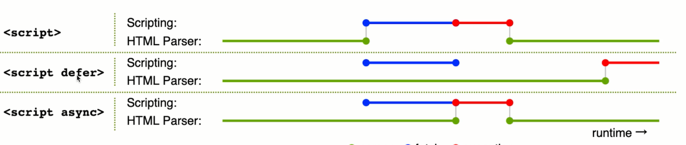

# HTTP

|  HTTP  |                 TCP                 |          UDP           |
| ------ | ----------------------------------- | ---------------------- |
| 应用层 | 传输层                               | 传输层                  |
| 单元格 | 三次握手（有连接），四次挥手（有断开） | 无连接、无断开           |
|        | 稳定传输                             | 不稳定传输，但效率高     |
|        | 常见网络请求（HTTP）                 | 适用于视频会议、语音童话 |

## TCP 协议

### HTTP1.0

+ 最基础的HTTP协议
+ 每次请求都会TCP连接和断开
### HTTP1.1
+ 缓存策略 cache-control 、E-tag等
+ 支持长连接 Connection：keep-alive，一次TCP链接可以发送多次请求
+ 断点续传，状态码 206，大文件分片上传
+ 支持新的方法 PUT、DELETE等，可用于 Restful API

### HTTP2.0

+ 可压缩header，减少体积
+ 多路复用，一次TCP连接可以支持多个HTTP并发请求
    - 优化：js文件，css文件合并成一个返回，减少请求次数，增加性能
+ 服务端推送（一般用websocket）

### HTTPS

+ HTTP 明文传输（用户名、密码啥的都是明文传输）
+ HTTPS 加密传输 HTTP + TLS/SSL
+ 先用非对称加密，然后用对称加密

> 中间人攻击
> 通过合法的第三方证书可以避免中间人攻击

|       HTTP1.0        |    HTTP1.1     | HTTP2.0 |
| -------------------- | -------------- | ------- |
| 最基础的HTTP协议       |                |         |
| 每次请求都会连接和断开 | 1. 缓存策略2.  |         |

#### HTTP defer async 有什么区别

defer 有点类似把 script 放在 body 最后面，不过是defer是并行下载

> JS的加载可以是并行加载，但是执行一定是阻塞浏览器解析（HTML Paser）
> 原因是 JS是单线程，和浏览器DOM解析公用一个线程，因为JS的执行有可能修改DOM

#### prefetch 和 dns-prefetch

##### prefetch 和 preload

+ preload 资源在当前页面使用，会优先加载
+ prefetch 资源在未来页面使用，空闲时加载

##### dns-prefetch 和 preconnect

+ dns-prefetch 即DNS预查询
+ preconnect 即DNS预连接

## WebSocket

+ 支持端到端通讯，
+ 可以有client发起，也可以有server发起，协议名时ws://
+ 用于：消息通知，直播间讨论区，聊天室，协同编辑
+ 没有跨域限制

### WebSocket连接过程

1. 先发起一个HTTP请求
2. 成功之后再升级到WebSocket协议，再通讯

|             websocket             |                http长轮询                 |
| --------------------------------- | ---------------------------------------- |
| 客户端发起请求，服务端也可以发起请求 | 客户端发起请求，服务端阻塞等待，不会立即返回 |
|                                   | 需要注意timeout，timeout后重新发送请求      |