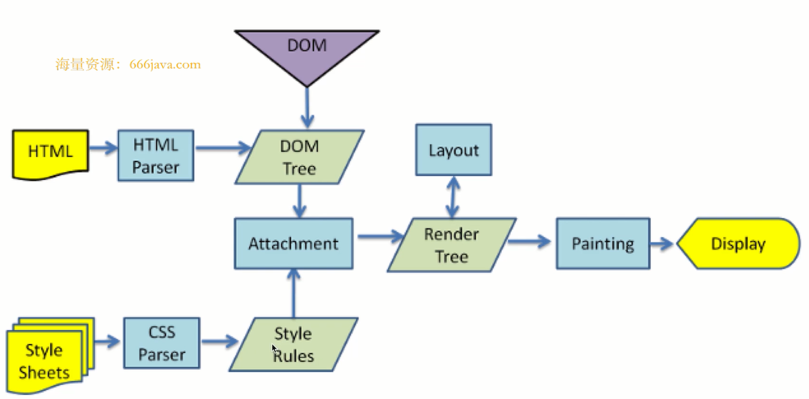
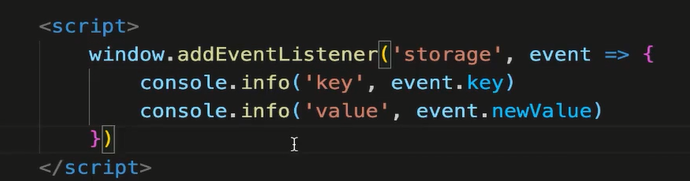

# 从输入URL到网页显示的完整过程

## 网络请求

1. DNS查询（得到IP），建立TCP（三次握手）
2. 浏览器发起HTTP请求
3. 收到请求相应，得到HTML源代码
    1. 解析HTML过程中，遇到静态资源会继续发起网络请求（JS、CSS、图片、视频等）
    2. 静态资源会有缓存，判断缓存时都过期
        
## 解析（字符串 -> 结构化数据）

1. HTML 构建DOM树
2. CSS构建CSSOM树（stylet ree）
3. 两者结合，形成render tree

## 渲染(render tree 绘制到页面)

1. 计算各个DOM的尺寸、定位，最后绘制到页面上
2. 遇到JS可能会执行（参考defer async）
3. 异步CSS、图片加载，可能会出发重新渲染

## 网页多标签 tab通讯

1. 使用websocket
    + 无跨域限制
    + 需要服务器支持，成本较高
 2. 通过localStorage通讯（同域的页面）localStorage跨域不共享
    + A页面设置localStorage，B页面可以监听到localStorage值的修改
    + window通过监听 storage，可以监听localStorage改变
    
 3. 通过SharedWorker通讯
    + ShareWorker 是WebWorker的一种。[web-worker](https://www.ruanyifeng.com/blog/2018/07/web-worker.html)
    + WebWorker 可开启子进程执行JS，但是不能操作DOM
    + ShareWorker可以开启一个进程，用于同域页面通讯
    
## 网页和Iframe通讯

+ 使用postMessage通讯
+ 注意跨域的限制和判断，发送消息的时候可以设置发送目标的域名
+ 接受消息的时候，可以通过 event.origin 判断消息来源的域名